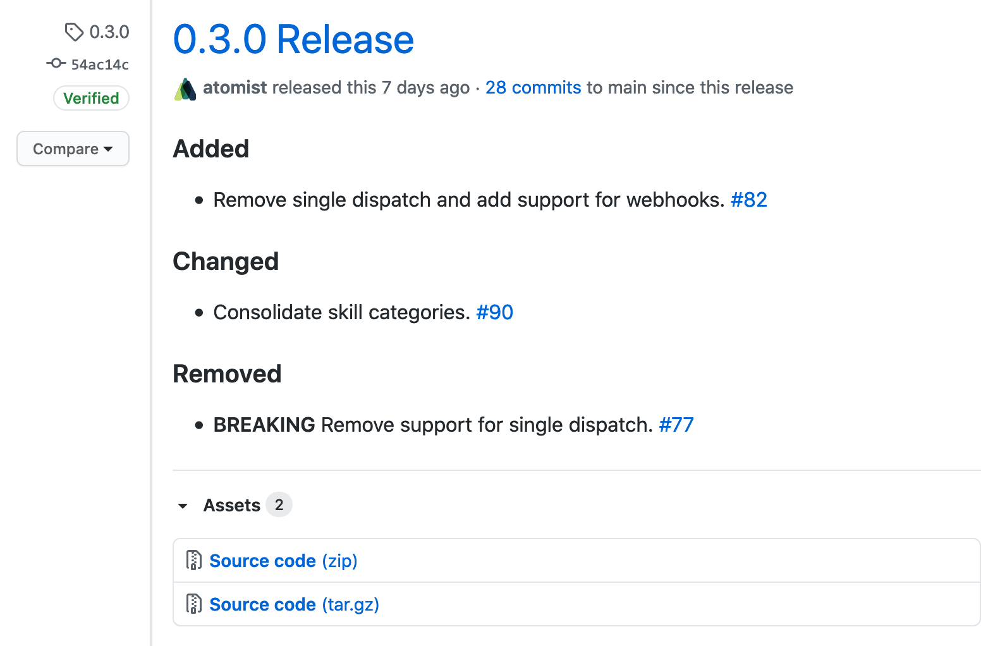
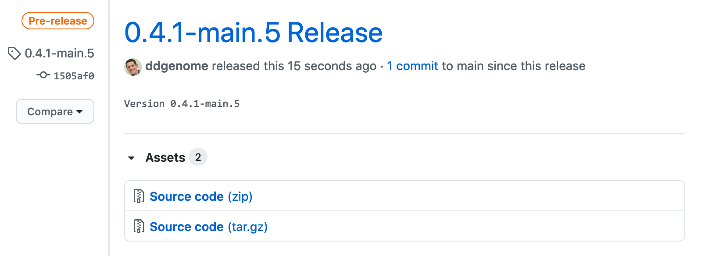

In a typical release flow on GitHub, you push a semantic version tag when you
want to release a new version. This skill facilitates this release flow by
automating the creation of a GitHub release. When a tag is pushed to a selected
repository that looks like a [semantic version][semver], this skill creates a
[GitHub Release][gh-release] for that tag.

_This skill is quite powerful when used with the [Keep a Changelog skill][kac]._

[semver]: https://semver.org/ "Semantic Versioning"
[gh-release]:
    https://docs.github.com/en/github/administering-a-repository/about-releases
    "GitHub Releases"
[kac]:
    https://go.atomist.com/catalog/skills/atomist/keep-a-changelog-skill
    "Keep a Changelog Skill"

### Create a GitHub release from a semantic version tag

### Create a GitHub prerelease from a prerelease tag

