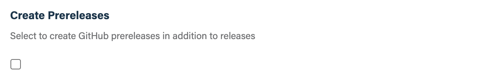

## Before you get started

Connect and configure the [**GitHub**][github] integration.

[github]: https://go.atomist.com/catalog/integration/github "GitHub Integration"

## How to configure

1.  **Choose whether you want to create prereleases**

    

    GitHub releases support both full releases and prereleases. Check this box
    if you want to create both, i.e., create a release when a release semantic
    version, e.g., `1.2.3`, is pushed and create a prerelease when a prerelease
    semantic version, e.g., `1.2.3-feature.4`, is pushed.

2.  **Determine repository scope**

    

    By default, this skill will be enabled for all repositories in all
    organizations you have connected.

    To restrict the organizations or specific repositories on which the skill
    will run, you can explicitly choose organization(s) and repositories.

3.  **Activate the skill**

    Save your configuration and activate the skill by clicking the "Enable
    skill" button.
